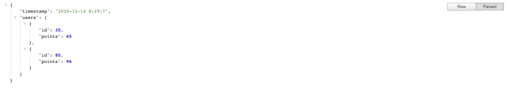

# Woot

This is a tiny api with a single endpoints that fetches a max of 2 users with more points than
max_number which is a genserver state.

# Running the server.

  * Make sure all the dependancies are installed by running `mix deps.get`
  * Run `mix ecto.setup`, this will create the database, run migrations and seed data to the database
  * Start the Server by `mix phx.server` command.

On your browser, visit [`localhost:4000`](http://localhost:4000/api/users)

# Demo

  After starting the server and visiting [`localhost:4000`](http://localhost:4000/api/users), you should see something like this.

  

  You can refresh the page after every 1 minute to get new json data of users

# Running Tests
You can run tests with the `mix test` command

# Challenge
  The first time the you visit the webpage an error `no function clause matching in DateTime.from_unix/3` shows up. After refreshing the page the error should not show up.

  The error is caused by the following code `{:ok, d} = DateTime.from_unix(state.timestamp, :second)` and the reason is because when the state starts the timestamp is nil.

  As per writing this, I have not found a hack for this but I am working towards solving that later.